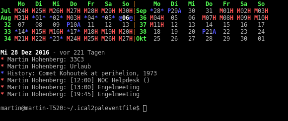

# ical2paleventfile

'pal' is a command-line calendar on unixoid systems - it's really small and fast, especially when you work with the console a lot  to begin with. Most of us keep their calendars on some online service today, though, so synchronisation to pal is a bit of pain. 

This little script converts an ical to a pal-compatible eventfile

## License

This script is licensed under the GPLv3 or later.

## Requirements

* ics 0.31 or later (--> pip install ics)

## Installation

### 1. Download this repository
### 2. Install the script

This script installs into /usr/local/bin - on most Linux distributions, that a directory that is included into the $PATH, so you should be able to run ical2paleventfile from anywhere in your cli.

    sudo make install

### 3. Create the configuration

ical2paleventfile *needs* a configuration file under ~/.ical2paleventfile/calendars.conf. This file must be manually created by you.

    $ mkdir ~/.ical2paleventfile
    $ pico ~/.ical2paleventfile/calendars.conf

In this file, you need to add a *section* for every ical file you want to syncronize down to pal. A section follows this structure:

    [calendar0815]   # Make sure the section name is different for every calendar. Only alphanumerical characters, no spaces!
    url = [URL of the ICS file - escape % with %%]
    palname = [output pal event filename] # always in your userdir under ~/.pal
    name = [name of the calendar]
    shorthand = [2-character shortcode]

So, for example, this may look like the following:

    [myCalendar]
    url = http://www.example.com/myCalendar.ics
    palname = mycalendar.pal
    name = my personal calendar
    shorthand = mc

You can add as many sections as you like. If you want to deactivate a section, you can comment out all lines related to it by adding a # in front of it.

### 4. Run ical2paleventfile for the first time.

This is a good time to start ical2paleventfile for the first time so calendars can be downloaded. 

    $ ical2paleventfile

There now should be pal event files in ~/.pal/ corresponding to your configuration.

### 5. Make pal aware of the new file

    $ pico ~/.pal/pal.conf

For each calendar file you have just created, add a new line in the form

    file mycalendar.pal

You can use colours to distinguish between calendars later

    file mycalendar.pal (red)

### 6. (optional) Make sure the script runs regularily

ical2paleventfile only runs when you allow it to run. You may want to create a cronjob for it, or to add it to your ~/.profile script.
